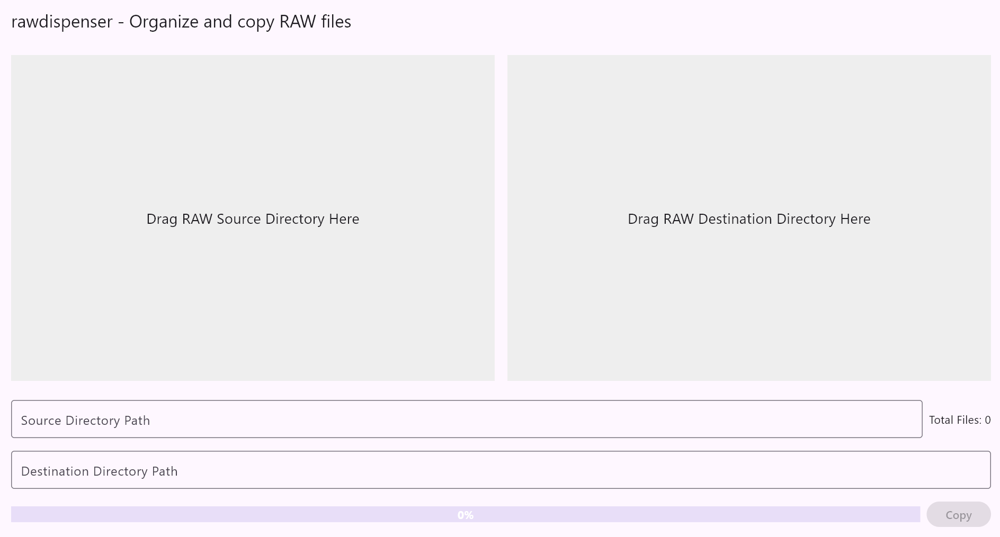

# rawdispenser



## Introduction

rawdispenser is a program I developed after switching my photo editing software from Adobe Lightroom Classic (hereinafter LRC) to Adobe Lightroom (hereinafter LR). Unlike LRC, which has an import feature, LR has no choice but to search for photo files directly in the file system. This change disrupted my workflow in LRC, where I used the import function to organize photos from my memory card by date.

Initially, I imported photos with LRC and then edited them in LR, but this workflow proved to be too cumbersome. I wanted a program that could analyze RAW files and copy them according to specific rules. rawdispenser was created to meet my needs using the ChatGPT-o3-mini-high model.

I built the program with Flutter to ensure it runs on both Windows and macOS. The EXIF data used to determine the capture date of RAW files is obtained through ExifTool (https://exiftool.org/). ExifTool was packaged into a single executable using the following PAR-Packer option:

```
pp -I .\lib -o exiftool.exe exiftool # On Windows
pp -I ./lib -o exiftool.out exiftool # On macOS
```

Currently, RAW files are copied into directories following this structure:

```
DestinationDirectory/YYYY/YYYY-MM/YYYY-MM-DD
```

In a future update, this format will be made freely configurable.

## Availability

rawdispenser currently supports Windows(x64) and macOS(Apple Silicon)

## Handling Duplicate Files

If a file with the same name already exists in the destination directory, the program prefixes the file name with `dup[the first 8 characters of the md5 hash of the copy start time]_`. For example, if you try to copy `DSC00452.ARW` and a file with that name already exists, it will be renamed to `dup7adfc1ad_DSC00452.ARW`.

## TODO

### Major
[] Copy XMP files that correspond to RAW files
[] Skip copying files that have no EXIF data
[] Alert about skipped files

### Minor
[] Improve ExifTool execution speed
[] Customizable directory hierachy